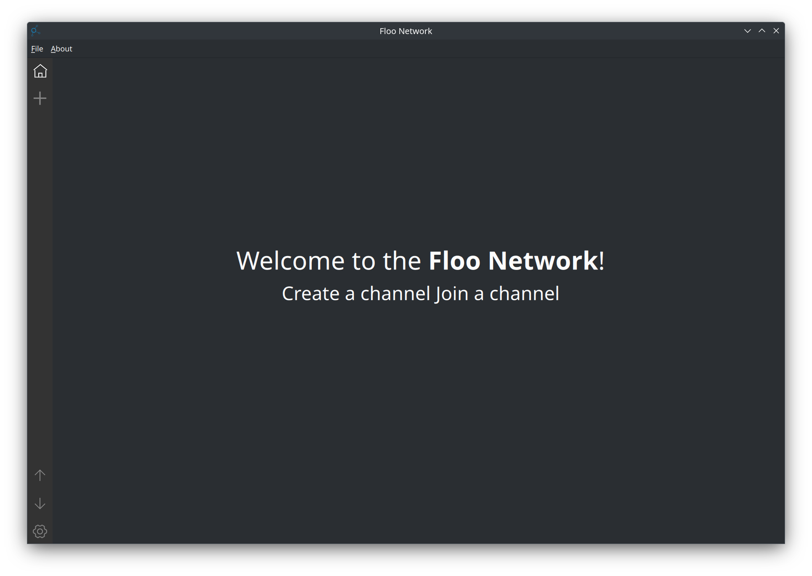

# Floo Network

A desktop application for file sharing that allows users to share and download files in real-time by creating or joining rooms. Simple to use, instantly connected, and secure for efficient file exchange.

English | [中文](./README_ZH.md)



## Compiling

```sh
$ git clone https://github.com/TaipaXu/floo-network.git
$ cd floo-network
$ mkdir build && cd build
$ cmake -DCMAKE_BUILD_TYPE=Release ..
$ make -j$(nproc)
```

## License

[GPL-3.0](LICENSE)
